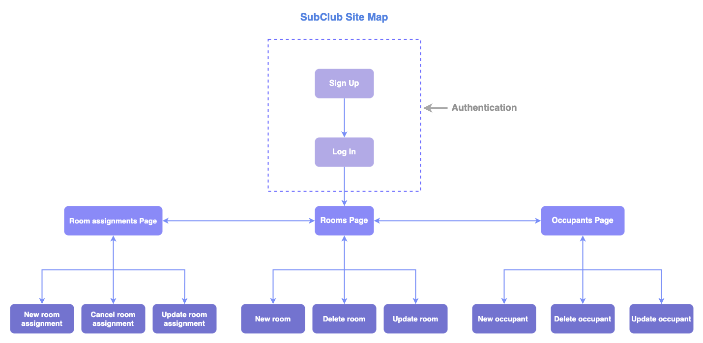

# SubClub - The Sublet Management App

🌎 Deployed App: https://thesubclubapp.netlify.app/

🖥 Client Repo: https://github.com/SubClub-The-Sublet-Management-App/subclub-frontend

🖥 Server Repo: https://github.com/SubClub-The-Sublet-Management-App/SubClub-backend/settings

📖 Part A Documentation Repo: https://github.com/SubClub-The-Sublet-Management-App/SubClub-Docs

## Overview

Sub.club is a web application that addresses Victoria's housing challenges by providing a streamlined solution for those looking to share their home by subletting. This application simplifies the management of rooms, occupants(tenant) and agreements made with each occupant. Focused on ease of use and automation, it aims to improve the subletting experience, filling a gap in the market left by existing solutions such as paper or Excel-based methods.

The application has been built with the MERN stack and deployed with Netlify and Heroku.

### Main features of the application:

#### User account:

- user account creation
- Login authentication
- Keeps the session open for a maximum of 24 hours for security reasons.
- Logout button to end the session.

#### Rooms:

- Creation of rooms available for subletting
- View users' rooms
- Button to update room information
- Button to delete rooms

#### Occupants:

- Create occupant profiles
- View occupant profile
- Button to update occupant profile data
- Button for deleting occupant

#### Room Assignment:

- Create room assignments by linking occupants and rooms, and adding information about payment arrangements and dates of stay.
- Display of each room assignment
- Button to update room assignment information.
- Button to cancel a room assignment.
- Display status of room assignments (active / cancelled).


## Installation Instructions

To use the production application, please visit [The SubClub App](https://thesubclubapp.netlify.app/) and create an account, and enjoy using the application!


*To use the app locally, please follow the below instructions.*

### Requirements:

- Node.js v18.18.0
- MongoDB Atlas account. _If you do not have MongoDB please visit [MongoBD Atlas](https://www.mongodb.com/docs/atlas/) and create a free account.


### SubClub App Local Setup Guide

#### Server:

1. **Create a Directory:**
   Open your terminal and create a directory for the SubClub app server side on your machine.

   ```bash
   mkdir SubClub-backend
   cd SubClub-backend
   ```

2. **Clone the Server Repo:**
   Clone the server repository into the newly created directory.

   ```bash
   git clone git@github.com:SubClub-The-Sublet-Management-App/SubClub-backend.git
   cd server
   ```

3. **Install Dependencies:**
   Install the required npm packages for the server.

   ```bash
   npm install
   ```

4. **Create .env file:**
    In the server directory, create a .env file and add your MongoDB Atlas [Connection String](https://www.mongodb.com/docs/guides/atlas/connection-string/), and the other variables for the set up.

```bash
    DB_URI=YourMongoDBAtlasConnectionStringHere

    PORT=3030

    JWT_KEY=YourSecretKeyHere
```

5. **Start the Server:**
   Start the local server.

   ```bash
   npm run dev
   ```

   The server will run on `http://localhost:3030`.

  

#### Client:

1. **Create a Directory:**
   Create a new directory for the `SubClub` app frontend. 

   ```bash
   cd ..
   mkdir sub-club-frontend
   cd sub-club-frontend
   ```

2. **Clone the Client Repo:**
   Clone the client repository into the `client` directory.

   ```bash
   git clone git@github.com:SubClub-The-Sublet-Management-App/subclub-frontend.git
   cd client
   ```

3. **Install Dependencies:**
   Install the required npm packages for the client.

   ```bash
   npm install
   ```

4. **Create .env file:**
   In the `sub-club-frontend` directory, create a `.env` file to connect with your server.

   ```env
    REACT_APP_BACKEND_URL=http://localhost:3030
   ```

5. **Ensure the Server is Running:**
   Make sure that your local server is still running on port 3030.

6. **Start the Client:**
   Start the local client.

   ```bash
   npm start
   ```

   The client will run on `http://localhost:3000`.

7. **Open in Browser:**
   A new browser window will open automatically, displaying the SubClub app.


You have successfully set up and run the SubClub app locally with MongoDB Atlas. Explore the features and enjoy using the application!

_____

## Frontend End Points 

| Route | Component | Description |
|-------|-----------|-------------|
| /signup | SignupPage | Display signup form to signup |
| /login | LoginPage | Display login form to login |
| /rooms | RoomsPage | Display all rooms and their details |
| /rooms/add-room | NewRoomsPage | Display a form to add new room |
| /occupants | OccupantsPage | Display all occupants and their profile details |
| /occupants/add-occupant | NewOccupantPage | Display a form to add new occupant |
| /room-assignments | RoomAssignmentsPage | Display all room assignments and their details |
| /room-assignments/add-room-assignment | NewRoomAssignmentPage | Display a form to add new room assignment |


_____


## Site Map

The Sub-Club App site map



## Screenshot of the website

